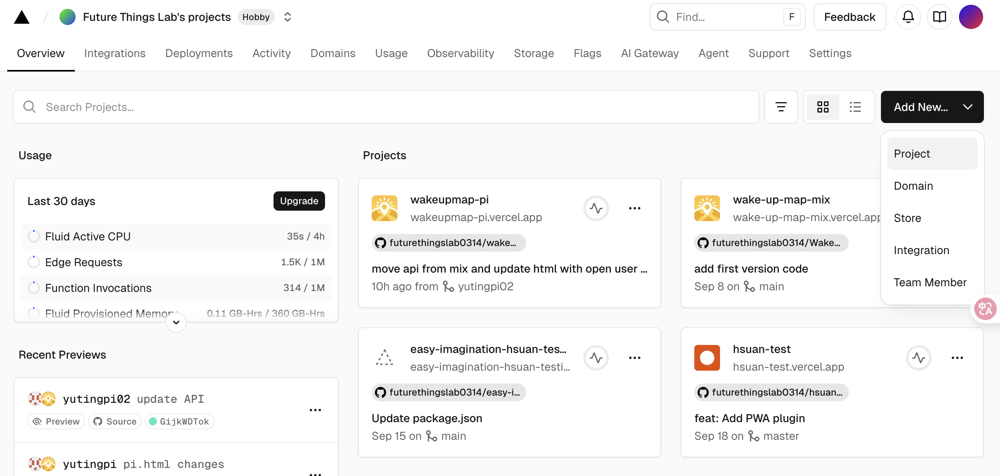

# 🍓 Raspberry Pi 甦醒地圖程式安裝指南
## **安裝前準備1：複製這份repository**
#### 小挑戰練習：
請將這份wakeupmap-pi, branch: yutingpi02版本，下載複製成一個新的branch或是開一個新的repository。
#### repository說明
repository意思是儲存空間oo。

#### 如果我之前下載過且將基本環境都設置過，會怎麼辦？
不需要進行raspberry pi 的基本環境建置，只需要把自己的改完的github 程式碼成功下載至自己的raspberrypi，以及更改 .env, desktop設定即完成。

## **安裝前準備2：連結你的github至vercel**
#### vercel說明
vercel是第三方平台幫我們保護重要的API以及可以公開發布html，讓大家可以瀏覽與連結和互動。我們將我們的github repository(儲存空間)與之相連，讓vercel可以讀取我們的儲存空間，發布我們寫的程式碼，串到API，讓網頁可以互動。
#### 為什麼要自己建立自己的？
為什麼要有自己的github repository以及自己的vercel project？擁有自己的，我們才能各自修改與上傳至可互動的空間上，每個人都有機會把裝置改成自己想要的版本，例如修改OpenAI說故事的prompt, 介面的調整, 按鈕互動的方式等等。如果共用同一個repository以及vercel link，那麼，我們只能複製出同樣的裝置。

#### 01. 至vercel創建一個'add new project'

#### 02. 將這個project 連結到github自己的branch或是新的repository。
#### 03. 在新建的project中，至settings / environment variables，新增key and value。
請新增以下key（value請查閱wakeupmap-pi 此vercel project中的environment variables），簡單來說，我們是在複製wakeupmap-pi 這個vercel project至一個新的project。
```bash
FIREBASE_ADMIN_CREDENTIALS
FIREBASE_API_KEY
FIREBASE_PROJECT_ID
FIREBASE_AUTH_DOMAIN
FIREBASE_STORAGE_BUCKET
FIREBASE_PRIVATE_KEY_ID
FIREBASE_PRIVATE_KEY
FIREBASE_CLIENT_EMAIL
FIREBASE_CLIENT_CERT_URL
OPEN_API_KEY
OPENAI_MODEL
```
#### 04. 進行deployment (production)，取得自己的vercel link。
回到overview，可以獲得domains的link，通常結構會是 帳號.vercel.app

#### 05. 請將這個 「帳號.vercel.app」記下或是貼在記事本上，以待晚點使用。
這個網址是用來讓raspberry pi後端處理將結果上傳後，會開啟放在雲端的pi.html (即你的vercel link)，因此，這個網址連結是為了讓程式碼連結到正確的vercel link裡面。

#### 06. 至github desktop，開啟你的github branch or repository的程式碼，用cursor打開。

#### 07. 將你的vercel link 取代掉甦醒地圖有vercel link 的每個地方 (可用查找確認)。
注意只是把範例code裡面的使用者名稱換成你的vercel使用者名稱，例如範例中是wakeupmap-pi.vercel.app/pi.html，即換成「你的使用者名稱.vercel.app/pi.html」。請運搜尋或是用cursor幫忙查找，檔案應該有七個，要更改：
```bash
raspberrypi-dsi/web_controller_dsi.py
raspberrypi-dsi/install_web_dsi.sh
raspberrypi-dsi/firebase_sync.py
raspberrypi-dsi/config.py
raspberrypi-dsi/audio_manager_openai_only.py
raspberrypi-dsi/audio_manager.py
```

#### 09. 更改pi.html，使用者名稱：
至pi.html找到下方程式碼，並將'yutingpi'改成'自己的使用者名稱'(即要使用這台甦醒地圖的使用者名稱)。

```bash
    <script>
      window.env = window.env || {};
      window.env.USER_NAME = 'yutingpi';
    </script>
```

#### 10. 存檔，上傳至github，確認vercel有成功deploy。完成！

## **回到Raspberry Pi畫面，下載程式！**

### **步驟1：首次安裝**
找到自己的branch安裝自己的git。
在Raspberrypi上的終端機(terminal) 輸入下列指令：
```bash
# 複製與載入自己的github，網址記得換成自己的版本
git clone -b branch的名稱 --single-branch https://github.com/你自己版本的github.git

# 檢查是否成功下載
git log --oneline -3
```

### **步驟 2: 安裝 環境相關**
```bash
# 更新系統套件
sudo apt update && sudo apt upgrade -y

# 安裝基本 Python 環境
sudo apt install python3 python3-pip python3-venv python3-full -y

# 進入 GPIO 控制程式目錄
cd wakeupmap-pi/raspberrypi-dsi

# 創建虛擬環境 (解決 PEP 668 限制)
python3 -m venv venv

# 啟動虛擬環境
source venv/bin/activate

# 安裝依賴到虛擬環境
pip install -r requirements.txt

# 檢查安裝是否成功，如果有成功，會輸出'DONE'此字！
python -c "import RPi.GPIO, selenium, pygame; print('DONE')"


# 檢查並安裝 pigpio (為了讓button可以被偵測到)
pip install pigpio

# 啟動 pigpiod 服務
sudo systemctl start pigpiod
sudo systemctl enable pigpiod

# 停用虛擬環境 (暫時)
deactivate
```

### **步驟 3: 設定API服務**
為什麼又要再次設定API呢？前面初始是設定給我們的前端網頁查閱，現在是設定給raspberry pi後端本地去查閱，故設定了兩次。為什麼這麼麻煩？我努力了....因為vercel阻擋讀取raspberry pi本地的資料，因此無法只做一次。

#### 新增一個名為 .env的檔案（為了進行本地環境變數設定） 
```bash
# 終端機(terminal)：
cd ~/wakeupmap-pi # 開啟wakeupmap-pi這個資料夾的意思
nano .env # 創建環境變數文件 #這個檔案是存放在raspberry pi local端，是一份鑰匙不可外露。
```
#### 在 .env裡面：
#### **步驟 3-1: 在.env裡面，將vercel中，找對應的KEY輸入置入：
```bash
FIREBASE_PROJECT_ID=放入vercel中的your-project-id
FIREBASE_WEB_API_KEY=
FIREBASE_AUTH_DOMAIN=
FIREBASE_MESSAGING_SENDER_ID=
FIREBASE_APP_ID=
FIREBASE_CLIENT_EMAIL=放入vercel中的your-service-account@your-project.iam.gserviceaccount.com
OPENAI_API_KEY=放入vercel中的sk-your-openai-api-key-here
```

#### **步驟 3-2: 在.env裡面，新增下列：
```bash
FIREBASE_PRIVATE_KEY=/home/pi的使用者名稱/wakeupmap-pi/raspberrypi-dsi/private_key.pem
USER_NAME=yutingpi  #改名稱，例如：yutingpi, alice, bob 等，將會是甦醒地圖的使用者代號。
WEBSITE_URL=https://wakeupmap-pi.vercel.app/pi.html #換成自己的vercel deploy link

# 保存並退出 (Ctrl+X, Y, Enter)
```

#### **步驟 3-3: 創建一份private_key.pem貼上在vercel查找到的「Firebase_private_key」置入
```bash
# 由於這份key很長並沒有直接貼在.env裡面，而是額外連結到另一個檔案。
nano ~/wakeupmap-pi/raspberrypi-dsi/private_key.pem
# 儲存並退出 (Ctrl+X, Y, Enter)
```

#### **步驟 3-4: 設定檔案權限 (僅擁有者可讀)以及確認是否成功查找API
```bash
chmod 600 ~/wakeupmap-pi/raspberrypi-dsi/private_key.pem

# 載入環境變數
echo 'export $(cat ~/wakeupmap-pi/.env | xargs)' >> ~/.bashrc
source ~/.bashrc

# 可以驗證環境變數是否設定成功
echo "Firebase Project: $FIREBASE_PROJECT_ID"
echo "Firebase Private Key Path: $FIREBASE_PRIVATE_KE"
echo "OpenAI API Key: ${OPENAI_API_KEY:0:20}..."
```

### **步驟 4: 設定 OpenAI TTS 語音** (可選)
如果 OpenAI API Key有成功貼至 .env，可以執行以下去調整AI 語音細節：

```bash
# 進入 GPIO 控制程式目錄
cd ~/wakeupmap-pi/raspberrypi-dsi 

# 使用虛擬環境
source venv/bin/activate 

# 執行 OpenAI TTS 設定工具
python3 setup_openai_tts.py 

# 設定工具會：
# 1. 自動安裝 OpenAI 庫
# 2. 偵測環境變數中的 API Key
# 3. 切換到 OpenAI TTS 引擎
# 4. 測試語音品質----> 直接測試會失敗，因有部分環境設定可能還未設定好，故可忽略不測試。

# 停用虛擬環境
deactivate

# 執行 GPIO 控制程式安裝腳本
cd raspberrypi-dsi
chmod +x install_web_dsi.sh

# 自動安裝
./install_web_dsi.sh 
```

### **步驟 5: 桌面app設置**
以下為設定raspberry pi 桌面app步驟：

```bash
nano ~/Desktop/WakeUpMap.desktop

# 在這份文件中貼上：

[Desktop Entry]
Version=1.0
Type=Application
Name=WakeUp Map
Comment=Run WakeUpMap Web App
Exec=bash -c 'cd /home/你的pi使用者名稱/wakeupmap-pi/raspberrypi-dsi && source venv/bin/activate && python main_web_dsi.py'
Icon=/home/你的pi使用者名稱/wakeupmap-pi/icon-192x192.png
Terminal=true
Categories=Utility;
Keywords=wakeup;map;raspberry;pi

# 儲存離開

# 設定執行權限
chmod +x ~/Desktop/WakeUpMap.desktop 
```
### **步驟 6: 完成。快樂的玩！**


## **日常維護**
```bash

# 更新程式碼
cd ~/wakeupmap-pi
git fetch origin
git pull origin 你的branch的名稱 #ex: yutingpi, main, morgan...

# 更新branch的分支
git fetch --all --prune
git branch -r #確認目前有抓到多少個branch

# 檢查目前的branch
git branch 

# 如果已經有本地分支，只要切過去：
git checkout 你想切換的branch名稱

# 如果本地還沒有這個分支：
git checkout -b 你想新開的branch名稱 origin/你想新開的branch名稱

#拉最新程式碼
git pull

# 修改樣式
nano pi-style.css

# 修改功能邏輯
nano pi-script.js

# 想要能夠透過瀏覽器了解問題log，暫時關閉全螢幕的方式：
# 至raspberrypi-dsi/web_controller_dsi.py中，找到下方程式碼，並臨時隱藏：
        # 全螢幕 kiosk 模式，隱藏瀏覽器分頁和工具列
        options.add_argument('--kiosk')
        options.add_argument('--disable-infobars')
        options.add_argument('--hide-scrollbars')


# 開啟開機自動啟動app的服務：

## 啟用開機自啟
sudo systemctl enable wakeupmap-dsi

## 立即啟動服務
sudo systemctl start wakeupmap-dsi

## 查看服務狀態
sudo systemctl status wakeupmap-dsi


```


# 🔧 Git 衝突處理完整指南
## 🚨 常見衝突類型

### **類型1: 本地修改衝突**
```bash
錯誤: 您對下列檔案的本機修改將被合併動作覆蓋：
  raspberrypi-dsi/config.py
```

### **類型2: 合併衝突**
```bash
CONFLICT (content): Merge conflict in raspberrypi-dsi/config.py
Automatic merge failed; fix conflicts and then commit the result.
```

### **類型3: 未追蹤檔案衝突**
```bash
錯誤: 工作目錄中未被追蹤的檔案 'example.txt' 將被合併動作覆蓋。
```

---

## ⚡ 快速解決方案

### **🔥 緊急快速處理（推薦）**

```bash
# 1. 備份你的重要修改
cp raspberrypi-dsi/config.py raspberrypi-dsi/config.py.backup

# 2. 暫存所有本地修改
git stash --include-untracked

# 3. 拉取最新代碼
git pull origin main

# 4. 恢復你的修改（如果需要）
cp raspberrypi-dsi/config.py.backup raspberrypi-dsi/config.py

# 5. 檢查差異（可選）
git diff raspberrypi-dsi/config.py
```

### **📁 保守安全處理**

```bash
# 1. 建立備份分支
git branch backup-$(date +%Y%m%d-%H%M%S)

# 2. 重置到遠端狀態
git reset --hard origin/main

# 3. 手動恢復需要的配置
# （從備份文件中複製回來）
```

---

## 📖 詳細步驟說明

### **步驟 1: 分析衝突狀況**

```bash
# 查看當前狀態
git status

# 查看修改內容
git diff raspberrypi-dsi/config.py

# 查看遠端最新提交
git log origin/main --oneline -3
```

### **步驟 2: 選擇處理策略**

#### **策略A: 保留本地修改（推薦用於config.py）**

```bash
# 1. 暫存修改並附註釋
git stash push -m "config.py本地設定-$(date +%Y%m%d)" raspberrypi-dsi/config.py

# 2. 拉取遠端更新
git pull origin main

# 3. 恢復本地修改
git stash pop

# 4. 如果有衝突，手動合併
git add raspberrypi-dsi/config.py
git commit -m "合併config.py本地設定"
```

#### **策略B: 使用遠端版本**

```bash
# 1. 備份本地修改
cp raspberrypi-dsi/config.py ~/config.py.backup

# 2. 重置到遠端版本
git checkout -- raspberrypi-dsi/config.py

# 3. 拉取更新
git pull origin main

# 4. 手動恢復需要的設定
nano raspberrypi-dsi/config.py
```

#### **策略C: 手動合併**

```bash
# 1. 強制拉取（允許衝突）
git pull origin main --no-ff

# 2. 手動編輯衝突文件
nano raspberrypi-dsi/config.py

# 3. 尋找衝突標記並解決
<<<<<<< HEAD
# 你的本地修改
=======
# 遠端的修改
>>>>>>> origin/main

# 4. 標記為已解決
git add raspberrypi-dsi/config.py
git commit -m "解決config.py合併衝突"
```


## 🛡️ 預防措施

### **1. 定期同步**
```bash
# 每天工作前
git fetch origin
git status
```


## 📋 常用命令速查表

| 操作 | 命令 | 說明 |
|------|------|------|
| 備份修改 | `git stash` | 暫存當前修改 |
| 查看暫存 | `git stash list` | 列出所有暫存 |
| 恢復暫存 | `git stash pop` | 恢復最新暫存 |
| 放棄修改 | `git checkout -- file` | 恢復到上次提交 |
| 重置分支 | `git reset --hard origin/main` | 完全重置到遠端 |
| 查看差異 | `git diff file` | 查看文件修改 |
| 強制拉取 | `git pull origin main --force` | 強制覆蓋本地 |

---

